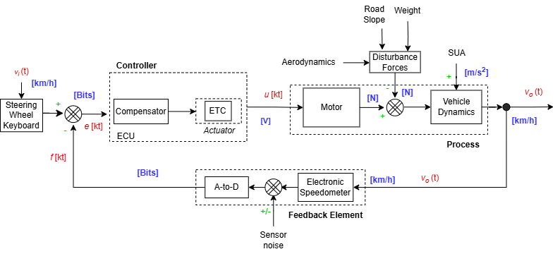

# Analysis and Simulation of Cruise Control Systems in Automotive Applications

Tomas A. Sanchez, July 2024.

Cruise Control (CC) is a system that automatically controls the speed of a motor vehicle. The system takes over the
throttle of the car to maintain a steady speed as set by the driver.

## Overview

The CC system is a feedback control system that uses a controller to maintain the desired speed.
The controller adjusts the throttle of the car based on the difference between the desired speed and the actual speed
of the car. The CC system is widely used in modern cars to improve fuel efficiency and reduce driver fatigue.

